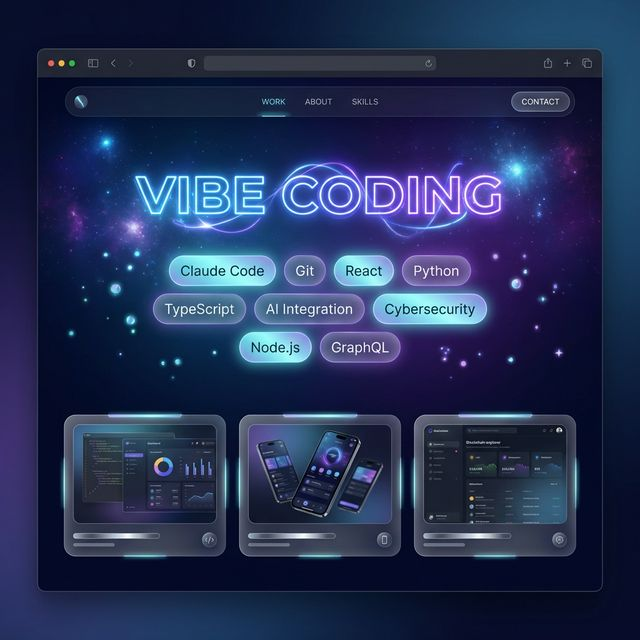
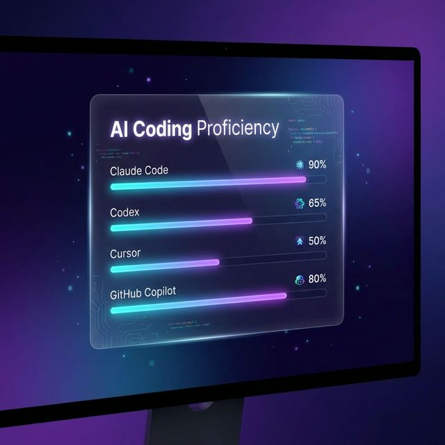
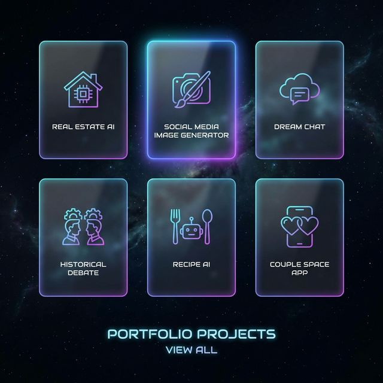
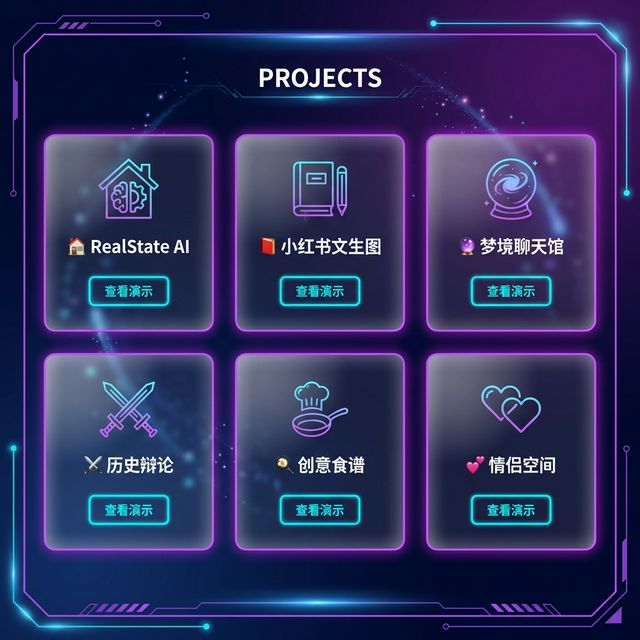
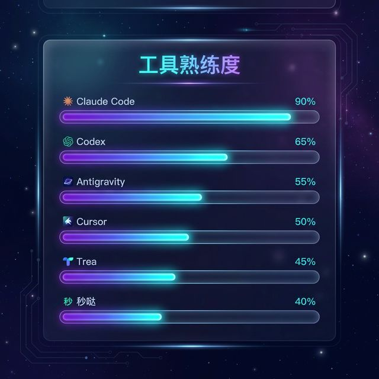
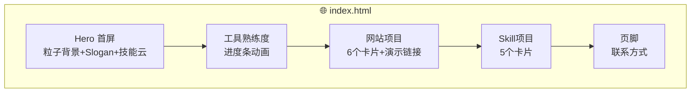
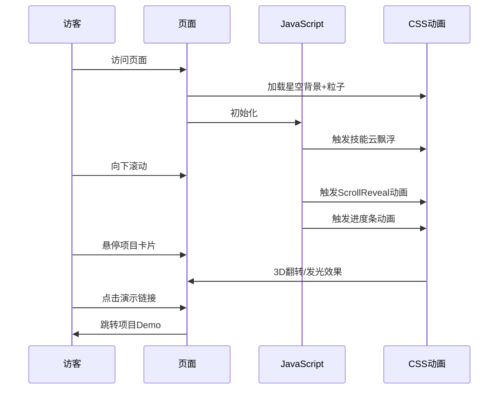

# 🚀 Vibe Coder 个人主页 PRD

> **版本**: V1.0 MVP | **日期**: 2026-02-08 | **状态**: ✅ 已确认

---

## 一、核心目标 (Mission)

> **用一个炫酷的个人主页，向 HR 展示 Vibe Coding 狂热爱好者的技术实力与项目成果。**

---

## 二、用户画像 (Persona)

| 属性 | 描述 |
|------|------|
| **目标用户** | HR、技术面试官、潜在合作者 |
| **核心场景** | 收到简历后浏览个人主页，快速评估能力 |
| **用户痛点** | 简历内容单调、项目无直观展示 |

---

## 三、选定方案：🌌 星空粒子风

**设计理念**：深邃星空背景 + 流动粒子 + 霓虹光效

**视觉要点**：
- 深蓝/紫黑渐变背景 + 浮动粒子
- 霓虹蓝/紫/青色调
- 卡片毛玻璃效果 + 发光边框
- 滚动视差效果

---

### 🎨 UI 设计稿（开发必须严格遵循）

#### 首页 Hero 区域


#### 工具熟练度区域


#### 网站项目展示区域


#### 整体项目卡片设计


#### 工具区域备用设计


---

> ⚠️ **开发注意**：前端实现必须严格按照上述设计图的配色、特效和布局来开发，确保视觉效果一致。

---

## 四、架构设计蓝图

### 4.1 页面组件结构



### 4.2 渲染流程



### 4.3 文件结构

```
个人主页作品/
├── index.html          # 主页面
├── css/
│   └── style.css       # 样式（含动画）
├── js/
│   ├── particles.js    # 粒子效果
│   └── main.js         # 主逻辑
└── assets/
    └── images/         # 项目封面图（可选）
```

### 4.4 技术选型

| 层级 | 技术 | 说明 |
|------|------|------|
| 结构 | HTML5 | 语义化标签 |
| 样式 | Vanilla CSS | 渐变、毛玻璃、动画 |
| 交互 | Vanilla JS | 粒子、滚动动画 |
| 粒子 | particles.js | 星空粒子效果 |
| 部署 | 静态托管 | GitHub Pages / Vercel |

### 4.5 组件交互说明

| 组件 | 交互效果 |
|------|---------|
| 粒子背景 | 鼠标移动时粒子跟随 |
| 技能标签 | 悬停发光、飘浮动画 |
| 进度条 | 滚动到视口时播放填充动画 |
| 项目卡片 | 悬停3D倾斜、发光边框 |
| 演示按钮 | 点击跳转新标签页 |

### 4.6 潜在风险

| 风险 | 应对 |
|------|------|
| 粒子过多导致卡顿 | 限制粒子数量，移动端减少 |
| 字体加载慢 | 使用系统字体回退 |
| 图片加载慢 | 使用懒加载 |

---

## 五、项目数据清单

### 网站项目 (6个)

| # | 名称 | 描述 | 演示链接 |
|---|------|------|:--------:|
| 1 | RealState AI 售房网站 | AI视觉分析生成房产文案 | `待填充` |
| 2 | 小红书文生图网站 | 长文一键转小红书图文 | `待填充` |
| 3 | 梦境聊天馆 | 语音对话AI解梦 | `待填充` |
| 4 | 历史名人辩论 | AI控制名人趣味辩论 | `待填充` |
| 5 | 创意食谱 H5 | AI评分+生成菜品效果图 | `待填充` |
| 6 | 甜蜜时光情侣空间 | 情侣生活记录+AI生图 | `待填充` |

### Skill 项目 (5个)

| # | 名称 | 描述 |
|---|------|------|
| 1 | Remotion 视频创作 | React程序化视频生成 |
| 2 | 微信群聊智能分析 | 自动分析生成HTML报告 |
| 3 | 微博热搜创意猎手 | 从热点挖掘产品创意 |
| 4 | YouTube 内容自动化 | 抓取转录改写全流程 |
| 5 | 微信公众号 AI 写作 | 选题到发布全自动化 |

### 工具熟练度

| 工具 | 熟练度 | 备注 |
|------|:------:|------|
| Claude Code | 90% | 最常用 |
| Codex | 65% | 修Bug利器 |
| Antigravity | 55% | 额度反代 |
| Cursor | 50% | - |
| Trea | 45% | - |
| 秒哒 | 40% | 小项目专用 |

### 技能标签

`Claude Code` `Codex` `Antigravity` `Cursor` `Trea` `秒哒` `Git` `RAG` `Transformer` `OpenClaw` `Next.js` `React` `Node.js` `Python`

---

## 六、验收标准

- [ ] 首屏加载 < 3秒
- [ ] 粒子动画流畅
- [ ] 所有项目卡片正确展示
- [ ] 演示链接可正常跳转
- [ ] 移动端响应式正常

---

> ✅ **PRD 已锁定** - 2026-02-08  
> 📎 开始开发实现
