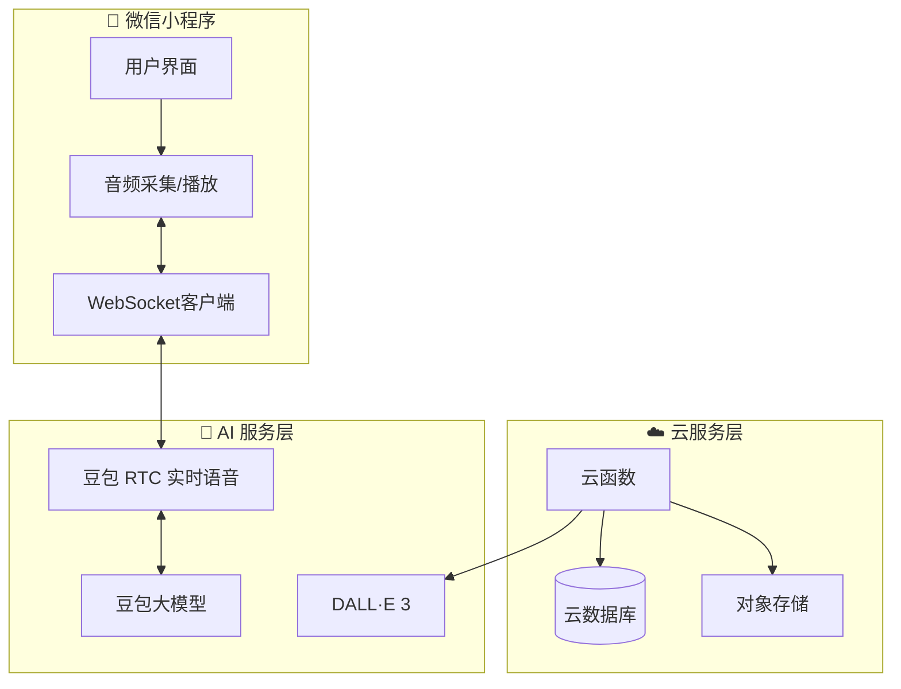
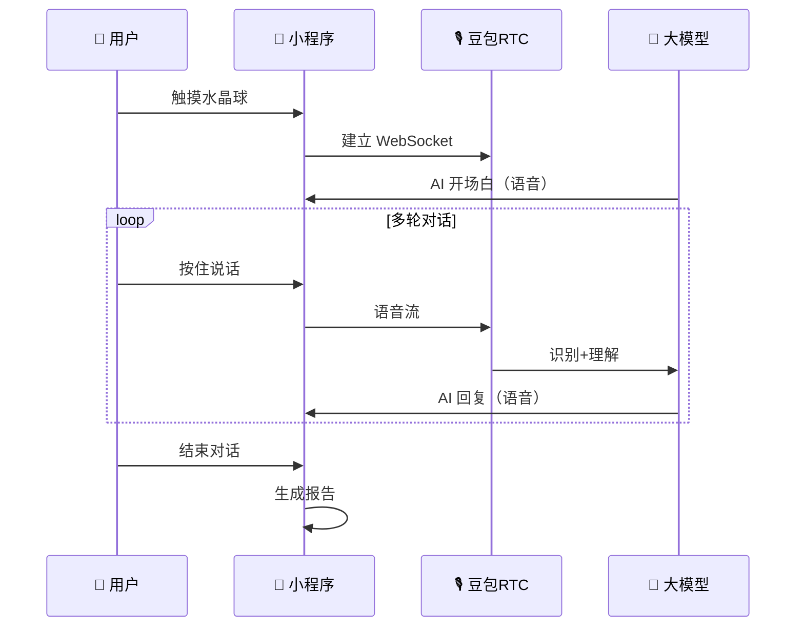

# 🌙 梦境聊天馆 - 产品需求文档 (PRD)

> **版本**: V1.0 MVP  
> **创建日期**: 2026-01-10  
> **更新日期**: 2026-01-10  
> **状态**: ✅ MVP 开发完成

---

## 一、核心目标 (Mission)

> **让每个人都能通过神秘的"梦境聊天馆"，与 AI 占卜师文字对话，解读内心深处的梦境密码，并生成专属的艺术化解梦报告。**

---

## 二、用户画像 (Persona)

| 属性 | 描述 |
|------|------|
| **目标人群** | 18-35岁广泛人群，对神秘学、心理探索、趣味社交有兴趣 |
| **核心场景** | 睡前/醒后回忆起印象深刻的梦，想知道它意味着什么 |
| **用户动机** | 好奇心驱动、娱乐消遣、社交分享、自我探索 |

---

## 三、选定的设计风格

### 🔮 方案 B：神秘传送门风格

**设计理念**：
- 强调仪式感和沉浸感
- 用户仿佛进入另一个神秘世界
- 水晶球作为核心交互入口
- 深空星云背景，魔法符文环绕
- 高度沉浸的梦幻体验

**视觉参考**：见 `prototype_b_portal_style.png`

---

## 四、MVP 功能清单

| # | 功能 | 描述 | 优先级 |
|---|------|------|--------|
| 1 | 📞 梦境热线（语音对话） | 用户"触摸水晶球"进入，与 AI 占卜师实时语音对话 | P0 |
| 2 | 🔮 AI 占卜师人设 | 神秘、智慧、温柔的占卜师形象"星月灵" | P0 |
| 3 | 🎙️ 多轮对话挖掘 | AI 像记者一样追问细节，挖掘梦境深层含义 | P0 |
| 4 | ⏹️ 智能结束判断 | 用户可随时结束；AI 也能判断信息充足后主动结束 | P0 |
| 5 | 📜 梦境解读报告 | 生成结构化解梦报告（摘要、象征分析、解读、寄语） | P0 |
| 6 | 🎨 AI 艺术配图 | 根据梦境内容实时生成独特艺术风格配图 | P0 |
| 7 | 🏷️ 梦境人格标签 | 生成专属标签（如"星际漫游者"、"深海寻梦人"） | P1 |
| 8 | 📥 长图下载 | 将报告合成精美长图，保存到相册 | P0 |
| 9 | 📤 社交分享 | 分享到微信朋友圈/好友 | P0 |

---

## 五、V2+ 未来版本规划

| 版本 | 功能 | 描述 |
|------|------|------|
| V2 | 📔 梦境日记本 | 保存历史梦境解读，形成个人档案 |
| V2 | 📊 梦境周报/月报 | 分析梦境规律 |
| V2 | 🎵 沉浸式 BGM | 对话配合神秘音效 |
| V3 | 🌐 匿名梦境广场 | 用户匿名分享梦境 |
| V3 | 🎁 梦境盲盒 | 每日随机赠送梦境元素卡片 |

---

## 六、关键业务规则

| 规则 | 描述 |
|------|------|
| **对话启动** | 用户触摸水晶球后，播放进入动画，AI 占卜师开场白自动播放 |
| **对话轮次** | 无固定限制，AI 根据信息完整度判断（建议 3-8 轮） |
| **结束触发** | ① 用户主动挂断 ② AI 询问"是否开始解读" ③ 5分钟超时 |
| **报告生成** | 对话结束后立即生成解读报告 + 艺术配图 + 人格标签 |
| **内容安全** | 对用户输入和 AI 输出进行内容审核 |

---

## 七、数据契约

```typescript
// 梦境会话
interface DreamSession {
  sessionId: string;
  userId: string;
  startTime: Date;
  endTime: Date;
  status: 'ongoing' | 'completed' | 'cancelled';
  dialogues: Dialogue[];
}

// 梦境解读报告
interface DreamReport {
  reportId: string;
  sessionId: string;
  dreamSummary: string;        // 梦境摘要
  symbols: SymbolAnalysis[];   // 象征分析
  interpretation: string;      // 心理解读
  blessing: string;            // 占卜师寄语
  personalityTag: string;      // 梦境人格标签
  artworkUrl: string;          // AI艺术配图
  longImageUrl: string;        // 合成长图
}
```

---

## 八、系统架构



---

## 九、核心流程

### 实时语音对话流程



---

## 十、技术选型

| 层级 | 选型 | 说明 |
|------|------|------|
| 前端 | 微信小程序原生 | 最佳兼容性 |
| 实时语音 | 豆包 RTC | 端到端语音对话 |
| 对话模型 | 豆包大模型 | 与 RTC 深度集成 |
| 图像生成 | DALL·E 3 | 艺术感强 |
| 后端 | 微信云开发 | 快速部署 |

---

## 十一、所需 API 密钥

| 服务 | 密钥 | 状态 |
|------|------|------|
| 火山引擎 RTC | `App ID` + `App Key` | ⏳ 待提供 |
| 豆包大模型 | `X-Api-App-Key` + `X-Api-Access-Key` | ⏳ 待提供 |
| OpenAI DALL·E | `API Key` | ⏳ 待提供 |
| 微信小程序 | `wx5af64b62e8dd1cc0` | ✅ 已配置 |

---

## 十二、风险与应对

| 风险 | 应对措施 |
|------|---------|
| 语音延迟 | 使用豆包RTC优化方案 |
| API成本 | MVP限制免费次数 |
| 内容安全 | 接入内容审核服务 |
| 小程序审核 | 提前准备资质文档 |

---

> ✅ **PRD 已锁定，等待 API 密钥后开始开发**
